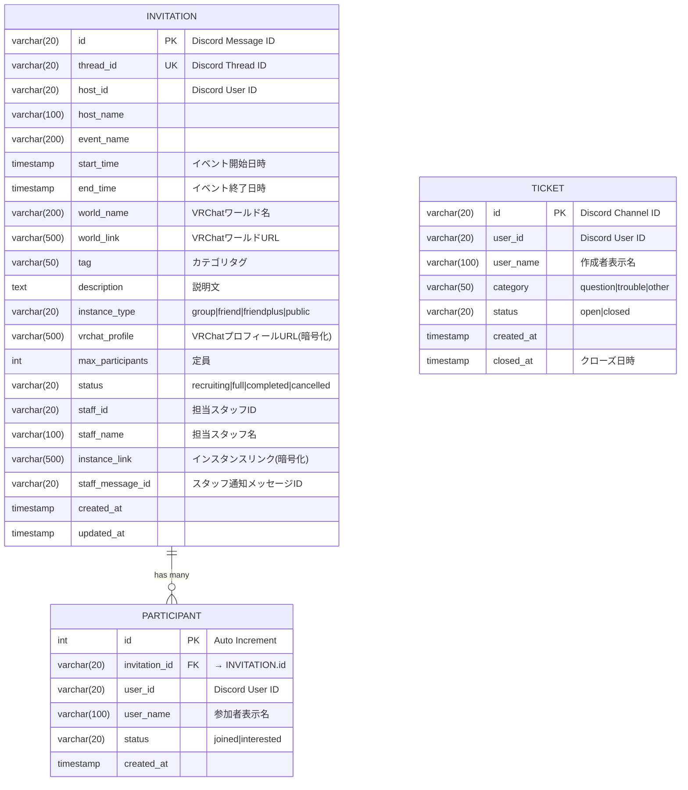

# Phase 2: 論理データモデル設計

## 1. エンティティ関連図（ER図）

### 1.1 Mermaid ER図



### 1.2 テキストベースER図（詳細版）

```
┌─────────────────────────────────────────────────────────────────────────────────┐
│                                  INVITATION                                     │
│                             (お誘い募集マスター)                                  │
├─────────────────────────────────────────────────────────────────────────────────┤
│ PK  id                VARCHAR(20)     NOT NULL  ← Discord Message ID            │
│ UK  thread_id         VARCHAR(20)     NOT NULL  ← Discord Thread ID             │
│     host_id           VARCHAR(20)     NOT NULL  ← Discord User ID               │
│     host_name         VARCHAR(100)    NOT NULL  ← 主催者表示名                   │
│     event_name        VARCHAR(200)    NOT NULL  ← イベント名                     │
│     start_time        TIMESTAMP       NOT NULL  ← 開始日時                       │
│     end_time          TIMESTAMP       NOT NULL  ← 終了日時                       │
│     world_name        VARCHAR(200)    NOT NULL  ← VRChatワールド名               │
│     world_link        VARCHAR(500)              ← VRChatワールドURL              │
│     tag               VARCHAR(50)     NOT NULL  ← カテゴリタグ                   │
│     description       TEXT            NOT NULL  ← 説明文                         │
│     instance_type     VARCHAR(20)     NOT NULL  ← インスタンスタイプ             │
│     vrchat_profile    VARCHAR(500)              ← VRChatプロフィールURL(暗号化) │
│     max_participants  INT             NOT NULL  ← 定員                           │
│     status            VARCHAR(20)     NOT NULL  DEFAULT 'recruiting'            │
│     staff_id          VARCHAR(20)              ← 担当スタッフID                  │
│     staff_name        VARCHAR(100)             ← 担当スタッフ名                  │
│     instance_link     VARCHAR(500)             ← インスタンスリンク(暗号化)      │
│     staff_message_id  VARCHAR(20)              ← スタッフ通知メッセージID        │
│     created_at        TIMESTAMP       NOT NULL  DEFAULT CURRENT_TIMESTAMP       │
│     updated_at        TIMESTAMP       NOT NULL  DEFAULT CURRENT_TIMESTAMP       │
│                                                                                  │
│ CHECK (start_time < end_time)                                                   │
│ CHECK (max_participants BETWEEN 1 AND 100)                                      │
│ CHECK (status IN ('recruiting', 'full', 'completed', 'cancelled'))              │
│ CHECK (instance_type IN ('group', 'friend', 'friendplus', 'public'))            │
└──────────────────────────────┬──────────────────────────────────────────────────┘
                                │
                                │ 1 : N
                                │
┌───────────────────────────────▼──────────────────────────────────────────────────┐
│                                PARTICIPANT                                       │
│                                (参加者情報)                                       │
├─────────────────────────────────────────────────────────────────────────────────┤
│ PK  id                INT             NOT NULL  AUTO_INCREMENT                  │
│ FK  invitation_id     VARCHAR(20)     NOT NULL  → INVITATION.id ON DELETE CASCADE│
│     user_id           VARCHAR(20)     NOT NULL  ← Discord User ID               │
│     user_name         VARCHAR(100)    NOT NULL  ← 参加者表示名                   │
│     status            VARCHAR(20)     NOT NULL  ← 参加ステータス                 │
│     created_at        TIMESTAMP       NOT NULL  DEFAULT CURRENT_TIMESTAMP       │
│                                                                                  │
│ UNIQUE (invitation_id, user_id)  ← 複合ユニーク制約                             │
│ CHECK (status IN ('joined', 'interested'))                                      │
└─────────────────────────────────────────────────────────────────────────────────┘

┌─────────────────────────────────────────────────────────────────────────────────┐
│                                    TICKET                                        │
│                               (チケット情報)                                      │
├─────────────────────────────────────────────────────────────────────────────────┤
│ PK  id                VARCHAR(20)     NOT NULL  ← Discord Channel ID            │
│     user_id           VARCHAR(20)     NOT NULL  ← 作成者Discord User ID         │
│     user_name         VARCHAR(100)    NOT NULL  ← 作成者表示名                   │
│     category          VARCHAR(50)     NOT NULL  ← カテゴリ                       │
│     status            VARCHAR(20)     NOT NULL  DEFAULT 'open'                  │
│     created_at        TIMESTAMP       NOT NULL  DEFAULT CURRENT_TIMESTAMP       │
│     closed_at         TIMESTAMP                 ← クローズ日時                   │
│                                                                                  │
│ CHECK (category IN ('question', 'trouble', 'other'))                            │
│ CHECK (status IN ('open', 'closed'))                                            │
│ CHECK (closed_at IS NULL OR closed_at >= created_at)                            │
└─────────────────────────────────────────────────────────────────────────────────┘
```

---

## 2. エンティティ詳細定義

### 2.1 INVITATION（お誘い募集マスター）

**ビジネス概要**:  
VRChatイベントの募集情報を管理するマスターエンティティ。Discord フォーラムスレッドと1:1対応。

#### 属性詳細

| カラム名 | 型 | 制約 | 説明 | ビジネスルール |
|---------|---|------|------|--------------|
| `id` | VARCHAR(20) | PK, NOT NULL | Discord埋め込みメッセージID | Snowflake ID（19桁数字） |
| `thread_id` | VARCHAR(20) | UK, NOT NULL | Discordスレッド(投稿)ID | Snowflake ID、1投稿=1募集 |
| `host_id` | VARCHAR(20) | NOT NULL, INDEX | 主催者のDiscord User ID | Snowflake ID |
| `host_name` | VARCHAR(100) | NOT NULL | 主催者表示名 | Discord表示名のスナップショット |
| `event_name` | VARCHAR(200) | NOT NULL | イベント名 | 1〜200文字、改行不可 |
| `start_time` | TIMESTAMP(3) | NOT NULL, INDEX | イベント開始日時 | 未来日時のみ（作成時）、timezone aware |
| `end_time` | TIMESTAMP(3) | NOT NULL | イベント終了日時 | start_time より後 |
| `world_name` | VARCHAR(200) | NOT NULL | VRChatワールド名 | 1〜200文字 |
| `world_link` | VARCHAR(500) | NULL | VRChatワールドURL | https://vrchat.com/... 形式 |
| `tag` | VARCHAR(50) | NOT NULL, INDEX | カテゴリタグ | 観光/ゲーム/まったり/撮影会/イベント/その他 |
| `description` | TEXT | NOT NULL | イベント説明文 | 最大2000文字 |
| `instance_type` | VARCHAR(20) | NOT NULL | インスタンスタイプ | group/friend/friendplus/public |
| `vrchat_profile` | VARCHAR(500) | NULL | VRChatプロフィールURL | **暗号化保存**、friend系必須 |
| `max_participants` | INT | NOT NULL | 定員 | 1〜100人 |
| `status` | VARCHAR(20) | NOT NULL, INDEX | 募集ステータス | recruiting/full/completed/cancelled |
| `staff_id` | VARCHAR(20) | NULL | 担当スタッフID | グループインスタンス建て担当 |
| `staff_name` | VARCHAR(100) | NULL | 担当スタッフ名 | スタッフ表示名スナップショット |
| `instance_link` | VARCHAR(500) | NULL | インスタンスリンク | **暗号化保存**、スタッフ入力 |
| `staff_message_id` | VARCHAR(20) | NULL | スタッフ通知メッセージID | スタッフチャンネルの通知メッセージ |
| `created_at` | TIMESTAMP(3) | NOT NULL | 作成日時 | 自動設定 |
| `updated_at` | TIMESTAMP(3) | NOT NULL | 更新日時 | 自動更新トリガー |

#### ビジネス制約

```sql
-- 時刻の論理整合性
CHECK (start_time < end_time)

-- 定員の妥当性
CHECK (max_participants BETWEEN 1 AND 100)

-- ステータスの値制限
CHECK (status IN ('recruiting', 'full', 'completed', 'cancelled'))

-- インスタンスタイプの値制限
CHECK (instance_type IN ('group', 'friend', 'friendplus', 'public'))

-- friend系の場合VRChatプロフィール必須（アプリケーション層で検証）
-- instance_type IN ('friend', 'friendplus') → vrchat_profile NOT NULL
```

#### ステータス遷移

```
[recruiting] ──定員到達──> [full]
     │                        │
     ├────開催終了────────────┤
     │                        │
     ▼                        ▼
[completed]             [completed]

[recruiting] ──主催者/スタッフ操作──> [cancelled]
[full]       ──主催者/スタッフ操作──> [cancelled]
```

**不変条件**:
- `completed` または `cancelled` 状態からの遷移は不可（最終状態）
- `status = 'full'` の場合、参加者数(status='joined') = max_participants

---

### 2.2 PARTICIPANT（参加者情報）

**ビジネス概要**:  
各募集への参加者を管理する従属エンティティ。1ユーザー×1募集に対して1レコード。

#### 属性詳細

| カラム名 | 型 | 制約 | 説明 | ビジネスルール |
|---------|---|------|------|--------------|
| `id` | INT | PK, AUTO_INCREMENT | 内部ID | サロゲートキー |
| `invitation_id` | VARCHAR(20) | FK, NOT NULL, INDEX | 募集ID | → INVITATION.id ON DELETE CASCADE |
| `user_id` | VARCHAR(20) | NOT NULL, INDEX | Discord User ID | Snowflake ID |
| `user_name` | VARCHAR(100) | NOT NULL | 参加者表示名 | Discord表示名のスナップショット |
| `status` | VARCHAR(20) | NOT NULL | 参加ステータス | joined（確定参加）/ interested（気になる） |
| `created_at` | TIMESTAMP(3) | NOT NULL | 参加日時 | 自動設定 |

#### ビジネス制約

```sql
-- 1ユーザー×1募集に対して1レコードのみ
UNIQUE (invitation_id, user_id)

-- ステータスの値制限
CHECK (status IN ('joined', 'interested'))

-- 外部キー制約（カスケード削除）
FOREIGN KEY (invitation_id) REFERENCES invitations(id) ON DELETE CASCADE
```

#### ビジネスルール

- **重複防止**: `(invitation_id, user_id)` 複合ユニーク制約
- **ステータス変更**: `interested` ⇄ `joined` の変更はUPDATE（新規レコード作成しない）
- **削除**: Invitation削除時に自動削除（CASCADE DELETE）
- **定員管理**: `status='joined'` のレコード数 ≤ `invitation.max_participants`（アプリケーション層でトランザクション制御）

---

### 2.3 TICKET（チケット情報）

**ビジネス概要**:  
サポートチケットを管理する独立エンティティ。Discord プライベートチャンネルと1:1対応。

#### 属性詳細

| カラム名 | 型 | 制約 | 説明 | ビジネスルール |
|---------|---|------|------|--------------|
| `id` | VARCHAR(20) | PK, NOT NULL | Discord Channel ID | Snowflake ID（プライベートチャンネル） |
| `user_id` | VARCHAR(20) | NOT NULL, INDEX | 作成者User ID | Snowflake ID |
| `user_name` | VARCHAR(100) | NOT NULL | 作成者表示名 | Discord表示名のスナップショット |
| `category` | VARCHAR(50) | NOT NULL | カテゴリ | question（質問）/trouble（トラブル）/other（その他） |
| `status` | VARCHAR(20) | NOT NULL, INDEX | チケットステータス | open（対応中）/ closed（クローズ済み） |
| `created_at` | TIMESTAMP(3) | NOT NULL | 作成日時 | 自動設定 |
| `closed_at` | TIMESTAMP(3) | NULL | クローズ日時 | クローズ時に設定 |

#### ビジネス制約

```sql
-- カテゴリの値制限
CHECK (category IN ('question', 'trouble', 'other'))

-- ステータスの値制限
CHECK (status IN ('open', 'closed'))

-- クローズ日時の論理整合性
CHECK (closed_at IS NULL OR closed_at >= created_at)
```

#### ビジネスルール

- **ステータス遷移**: `open` → `closed` のみ（一方向、再オープン不可）
- **クローズ処理**: `status='closed'` 設定時に `closed_at` を自動設定
- **保持期間**: クローズ後6ヶ月保持、その後アーカイブ（バッチ処理）

---

## 3. 正規化分析

### 3.1 第1正規形（1NF）

**定義**: すべての属性が原子値（繰り返しグループなし）

✅ **達成状況**:
- すべてのカラムがスカラー値
- 配列型・複数値を持つカラムなし

---

### 3.2 第2正規形（2NF）

**定義**: 1NF + 部分関数従属なし（非キー属性が主キー全体に関数従属）

✅ **達成状況**:
- **INVITATION**: 単一主キー `id` → すべての非キー属性が完全関数従属
- **PARTICIPANT**: 単一主キー `id` → すべての非キー属性が完全関数従属
  - 複合ユニークキー `(invitation_id, user_id)` は代替キー、部分関数従属なし
- **TICKET**: 単一主キー `id` → すべての非キー属性が完全関数従属

---

### 3.3 第3正規形（3NF）

**定義**: 2NF + 推移的関数従属なし（非キー属性が他の非キー属性に関数従属しない）

#### 検証: INVITATION

**潜在的な推移的従属**:
- `host_id` → `host_name`（Discord APIから取得可能）
- `staff_id` → `staff_name`（Discord APIから取得可能）

**非正規化の判断**:
- ✅ **保持**: `host_name`, `staff_name` をスナップショットとして保存
  - **理由**: Discord表示名は変更可能、履歴保持のためスナップショット必須
  - **トレードオフ**: 更新異常のリスク vs 履歴の正確性 → 後者を優先

#### 検証: PARTICIPANT

**潜在的な推移的従属**:
- `user_id` → `user_name`（Discord APIから取得可能）

**非正規化の判断**:
- ✅ **保持**: `user_name` をスナップショットとして保存
  - **理由**: 参加時の表示名を履歴保持

#### 検証: TICKET

**潜在的な推移的従属**:
- `user_id` → `user_name`（Discord APIから取得可能）

**非正規化の判断**:
- ✅ **保持**: `user_name` をスナップショットとして保存

---

### 3.4 正規化レベルの最終判定

**結論**: **第3正規形（3NF）を基本としつつ、意図的な非正規化を実施**

| エンティティ | 正規化レベル | 非正規化箇所 | 理由 |
|------------|------------|------------|------|
| INVITATION | 3NF | `host_name`, `staff_name` | 表示名履歴保持（スナップショット） |
| PARTICIPANT | 3NF | `user_name` | 参加者名履歴保持（スナップショット） |
| TICKET | 3NF | `user_name` | 作成者名履歴保持（スナップショット） |

**非正規化のトレードオフ**:
- ✅ **メリット**: 
  - JOIN不要で表示名取得（パフォーマンス向上）
  - Discord API障害時も表示可能
  - 過去の表示名を正確に履歴保持
- ❌ **デメリット**: 
  - 更新異常（ユーザーが表示名変更しても反映されない）
  - **対策**: これは仕様（履歴の正確性優先）、必要なら定期バッチで最新化

---

## 4. リレーション設計

### 4.1 INVITATION ⇄ PARTICIPANT（1:N）

**関連種類**: 1対多（One-to-Many）

**外部キー**:
```sql
PARTICIPANT.invitation_id → INVITATION.id
```

**削除時動作**:
```sql
ON DELETE CASCADE
```
- Invitation削除時、関連するParticipantも自動削除
- 理由: 従属エンティティ、募集がなければ参加者情報も無意味

**更新時動作**:
```sql
ON UPDATE CASCADE
```
- INVITATION.id 変更時、PARTICIPANT.invitation_id も自動更新
- ただし、実運用では主キー変更は発生しない（Discord Message IDは不変）

---

### 4.2 TICKET（独立エンティティ）

**関連**: なし（独立）

**理由**:
- チケットは他エンティティに依存しない
- 将来的に `TICKET_MESSAGE`（チケット内のメッセージ履歴）エンティティを追加する場合、TICKET が親となる

---

## 5. Definition of Done

- [x] Mermaidベース・テキストベースER図作成
- [x] 全エンティティの詳細属性定義（21項目 × 3テーブル）
- [x] ビジネス制約の明示（CHECK制約）
- [x] 正規化分析（1NF/2NF/3NF）完了
- [x] 非正規化の意図と根拠の文書化
- [x] リレーション設計（外部キー、削除/更新動作）完了
- [x] ステータス遷移図の作成

---

**次フェーズ**: [Phase 3: 物理データモデル設計](./03-physical-data-model.md)
